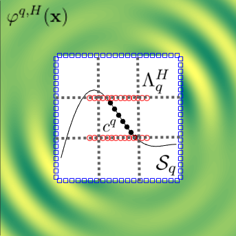
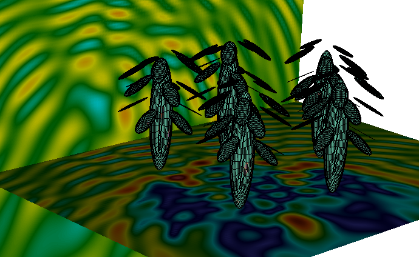
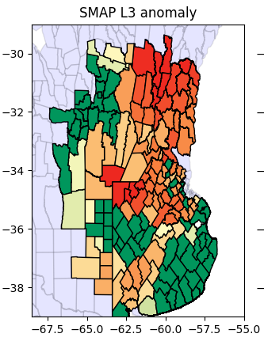

---
# Feel free to add content and custom Front Matter to this file.
# To modify the layout, see https://jekyllrb.com/docs/themes/#overriding-theme-defaults

title: home
layout: page
---

<b>Jefe de Trabajos Prácticos</b> -- Departamento de Matemática de Exactas-UBA

 <b>Investigador Asistente </b> -- CONICET 

 Lugar de trabajo -- Servicio Meteorológico Nacional

## Investigación

<b> Métodos numéricos eficientes y de orden alto </b> 

 Desarrollo metodologías numéricas de alto orden de precisión y eficiencia computacional para la resolución de ecuaciones de ondas o afines, usualmente basados en técnicas de ecuaciones integrales, polinomios ortogonales, representaciones asintóticas, FFTs, etc. 

<b> Scattering de superficies aleatorias y colecciones de partículas </b> 

 Me ocupo de la resolución de problemas de scattering en torno a geometrías con componentes aleatorios, con el objetivo de proveer conocimiento fundamental acerca de distintas tecnologías de observación remota como radares y sonares.

<b> Análisis de datos en teledetección </b> 

  Utilizo diversas herramientas, ya sea basadas en los modelos antes mencionados y/o en técnicas de estadística computacional, para colaborar en grupos interdisciplinarios (conformados por biólogos, meteorólogos, agrónomos, ingenieros electrónicos, físicos, etc) que abordan  problemáticas como el monitoreo de sequías e inundaciones, estimaciones de humedad del suelo o de evapotranspiración en bosques, entre otros temas de interés. Dichos estudios usualmente involucran la manipulación de grandes volúmenes de datos, con lo cual el empleo de algoritmos eficientes resulta de particular importancia.  

## Colaboro con

Applied and Computational Mathematics (<a href="http://www.its.caltech.edu/~obruno/">Caltech</a>)

Grupo de Teledetección (<a href="http://www.iafe.uba.ar/wordpress/">IAFE</a>)

Análisis Numérico (<a href="http://mate.dm.uba.ar/~rduran/research_group/participants.html">DM</a>) 

Acústica Submarina (Senid) 

Agrometeorología (FAUBA).

Centro de Simulación Computacional - Área de Radiofrecuencia (<a href="http://csc.conicet.gov.ar/">CSC</a>)

